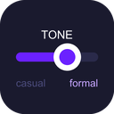

<div align="center">
  
  <h1>✨ ToneShift (Tonal)</h1>
  <p><strong>The two-way tone translator for the modern web.</strong></p>

  <p>
    
    
    
    
  </p>
</div>

<br>

## What is ToneShift?

Ever stared at an email for 15 minutes trying to sound "professional but not stiff"? Or received a corporate word-salad message that you had to re-read three times to understand? 

**ToneShift** is a lightweight, zero-dependency Chrome Extension that sits quietly in your favorite messaging apps. It acts as a Grammarly-style floating button that helps you translate the tone of your writing instantly, in both directions.

### 🎭 Two-Way Translation
1. **Sending (Casual ➔ Professional):** Type exactly what you're thinking ("hey can u send the doc"). One click rewrites it perfectly for your boss, client, or team.
2. **Receiving (Corporate ➔ Plain English):** Select any block of text on a page. Click "Decode" to instantly get a 1-3 sentence plain English summary of what they're *actually* asking you to do.

---

## 🚀 Supported Platforms
ToneShift automatically detects the unique text editors of modern web apps and injects itself seamlessly without breaking their UI.

- 📧 **Gmail** (Works in the compose box)
- 💬 **Slack** (Browser version)
- 💼 **LinkedIn** (Direct messages)
- 📱 **WhatsApp Web** 

---

## ⚙️ How It Works

### Sending (The Grammarly-Style Button)
When you click into a text box on a supported site, a small `✨` button appears in the bottom right corner.
1. Type your message normally.
2. Click the button to open the tone popover.
3. Choose your tone:
   - **📱 Texting:** Super casual, lowercase, short. 
   - **🤝 Work Chat:** Friendly but clear. How you talk to a colleague you actually like.
   - **👔 Corporate:** Formal, complete sentences. For HR, clients, or management.
4. The text instantly updates in your input box. (Not what you wanted? Hit the green **Undo** button).

### Decoding (The Floating Button)
1. Highlight any confusing, jargon-filled text on any web page.
2. A small **"Decode ↓"** button floats near your cursor.
3. Click it to get a brutal, honest, plain-English summary of what the text means.

---

## 🛠️ The Tech Stack (Zero-Dependency Flex)

We built ToneShift to be lightning-fast and incredibly lightweight. 

- **No React.**
- **No NPM.**
- **No Webpack/Vite.**
- **Pure Vanilla JavaScript, HTML, and CSS.**

It uses Chrome Extension Manifest V3 and relies on a background Service Worker to securely call the **Google Gemini 2.0 Flash API**. Your API key is encrypted and stored safely in `chrome.storage.sync`. 

---

## 📦 Installation (Developer Mode)

ToneShift is currently in active development. To install it locally:

1. Clone this repository:
   ```bash
   git clone https://github.com/kwakhare5/Tonal.git
   ```
2. Open Chrome and navigate to `chrome://extensions/`.
3. Enable **"Developer mode"** in the top right corner.
4. Click **"Load unpacked"** and select the `Tonal` folder you just cloned.
5. Pin the extension to your toolbar!

---

## 🔑 Getting Started (API Key)

ToneShift uses your own Gemini API key so it stays 100% free to use.

1. Go to [Google AI Studio](https://aistudio.google.com/app/apikey) and sign in.
2. Click **"Create API Key"** (It's free).
3. Copy the key.
4. Click the ToneShift extension icon in your Chrome toolbar.
5. Paste your key into the "Advanced / Custom API Key" field and hit **Save**.

You're ready to go! Refresh Gmail or Slack to see the button appear.

---

## 🤝 Contributing
Found a bug? Want to add support for Discord or Notion? 
1. Fork the project
2. Create your feature branch (`git checkout -b feature/AmazingFeature`)
3. Commit your changes (`git commit -m 'Add some AmazingFeature'`)
4. Push to the branch (`git push origin feature/AmazingFeature`)
5. Open a Pull Request

---

<div align="center">
  <i>Built with ❤️ to end corporate jargon forever.</i>
</div>
